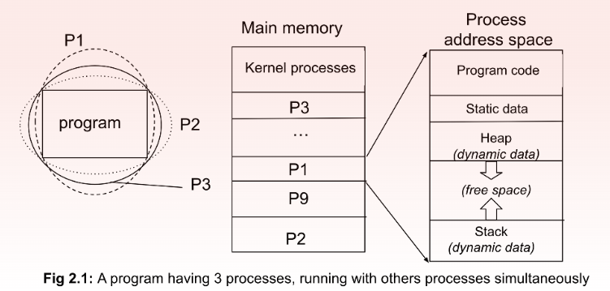
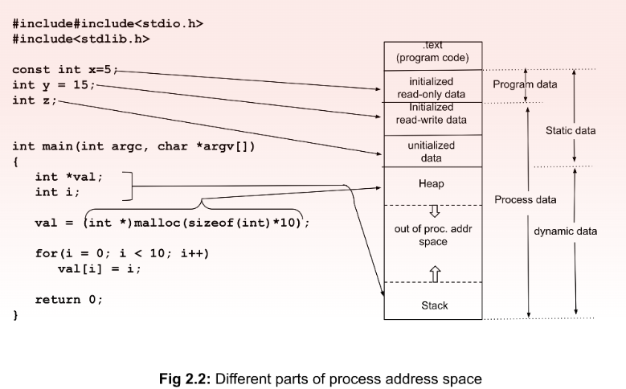
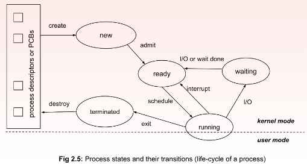
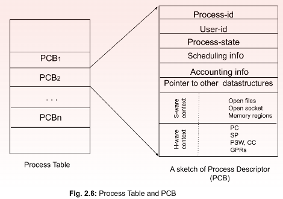
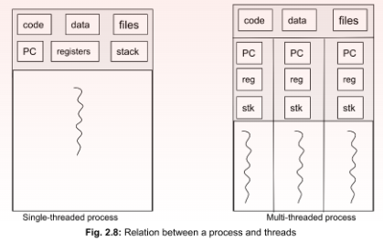
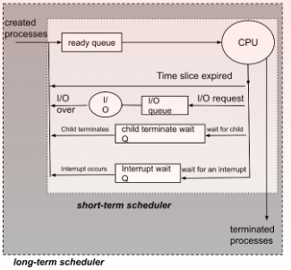

#### References
----
 - Operating Systems Book by Sukomal Pal
## Syllabus
---------
1. [Process, Process State](#1.Process-and-Process-State)
2. [Process Control Block (PCB)](#2.Process-Control-Block-(PCB))
3. [Threads](#3.Threads)
4. [Scheduling](#4.Scheduling)
5. [Scheduling algorithms](#5.Scheduling-Algorithm)
6. [First come First Served](#6.First-come-First-Served)
7. [Shortest Job First](#7.Shortest-Job-First)
8. [Round Robin Scheduling](#8.Round-Robin-Algorithm)
9. [Priority Scheduling](#9.Priority-based-Scheduling-Algorithm)
10. [Operations on processes](#10.Operation-on-Processes)
11. [Inter-process communication](#11.Inter-Process-Communication)

## 1.Process-and-Process-State
---------

When a program is executed, It becomes a process. A process is a program in execution. It is an active entity and dynamically changing. An OS considers processes as units of program execution or simply computation. A process contains application program (sequence of instructions) and data (arguments, variables etc...). A single program can have multiple processes running at the same time on a given machine even if the system has only 1 core.

Some of the processes can belong to application programs or user programs (called user processes), and some OS programs (called kernel processes).

Each process holds some attributes given by the OS as follows.

**Process-id**: a process identifier (pid)
**User-id**: the process is owned by a specific user (uid)
**Process Group-id**: Every process is supposed to belong to a group, based on the task. The group has a process group identifier (or pgid) 
**Address space**: main memory space (known as process address space) where it stores
   1. program (code)
   2. static data 
   3. dynamic data in the form of **heap** and **stack**

Kernel processes reside in kernel space (of main memory), execute OS kernel code in kernel mode, while user processes remain in user space and run user code in user mode and can make system calls 

### Process address space
When a program is executed, It is allocated space in the main memory. The space is called process address space. The space may be physically contiguous or non-contiguous depending on the memory allocation technique used by the OS.
- Text Section: It stores the program code (in executable form, not the source code).
- Data Section: This section stores the data that are used by the process. Some data comes attached to the program code that cannot be dynamically changed (globally declared and initialized as read-only data) - we call this as program data
    - Static data: This data is statically bound to program code and can be allocated space during compilation.
    -  Dynamic data: This data is not allocated during compilation, rather can only be allocated during program execution or in the run-time. It can grow or shrink during execution depending on the requirement of the process. It has two important sub-sections. 
         - a. Heap: During program execution the process dynamically allocates memory (as done by malloc()in Fig. 2.2) based on requirement and deallocates when the need is over.
         - b. Stack: This space is used by the arguments, local variables, return values of a function or a method within a source program. For each function call, stack stores the above variables and data structures for it. 
### Process State

1. New: This is the first state of a process. When a process is created or a program is invoked the OS creates a new execution context, allocates a process address space in the main memory and other necessary per-process resources in the kernel mode. 

2. Ready: Once the per-process resources are created, the process becomes ready for execution. It needs a processor (actually, a core of a processor, to be specific) to be allocated. 

3. Running: As soon as a processor is allocated, the process starts executing the instructions from the program text. Here, the program can run in user mode, However, for privileged instructions, it can go to kernel mode also. 

4. Waiting: When the process needs an I/O to be done or explicitly waits (via a system call like wait()), the process is taken off the processor and is considered to be waiting. When the I/O is complete or the explicit wait is over, the process becomes ready and joins the ready queue. It can run only when it is allocated to the processor. 

5. Terminated: When the process completes normally (even abnormally also), process address space is reclaimed by the OS. All process-related resources are also de-allocated. This state is called a terminated state.

### Process Context
After a process is created, it changes its states from one to another as it proceeds in its life cycle. Along with the states, there are several other parameters of a live process that the OS kernel has to keep track of. For example, which instruction a process is currently running and thus where the CPU will find the next instruction from (remember program counter or PC), how many special purpose registers (SPRs) like stack pointer (SP), program status word (PSW), condition codes (CC) it is using and what are their values.

## 2.Process-Control-Block-(PCB)
The OS kernel maintains a special type of data-structure called PCB in it's kernel space for each live process. This data-structure stores the context of a process.
- Process id
- User id
- Process state: process state can be new, ready, running, waiting, terminated
- Scheduling information: for CPU allocation to process, process priority, pointers to scheduling queues, and other scheduling parameters need to be maintained.
- Memory-management information
- Accounting information: Information like amount of CPU time used, wait time, time limits etc.
- Software context: This can be a list of open files, open sockets (ip-address + port-address, used for communicating with remote processes) and memory regions
- Hardware context: There are a number of hardware information that need to be kept track of like Program Counter, stack pointer, cpu registers, I/O devices.
- Pointers to different data structures
### Process Table

In a multiprogramming OS, multiple processes concurrently run. The kernel thus has to maintain more than one PCB. Often the PCBs are stored as a list in a table. This is a kernel data structure called a Process Table.

### Context Switch

**Explanation**: CPU have limited number of **cores**(2core, 12 core etc..). Every process executes in any one of the core. At a time only a single process can execute in this core but suppose if that process have to wait for an I/O event, this will waste the resource of the core as it is not doing any work(waiting for the I/O). To prevent this when an **I/O wait** happens the process is switched with another process from ready queue. During this change we need to save the state(data/context) of the previously executing process and load the state of the new process from the memory or registers.

**Definition**: When the CPU is changed from one process to another, the context of the first process is saved and that of the second process is loaded into appropriate registers and other data structures. We call this context switching or process switching. Mind that process switching happens from one process to another in relation to a CPU allotment and is managed by the OS

#### Who causes context switch and when?

Process are disturbed under 3 events: Interrupts, system call and trap.

1. **Interrupt**: An interrupt is an asynchronous activity. That can come from:

	1. The timer when time slice allocated for the running process is over and another process scheduled to run next needs to get the CPU.
	2. I/O devices when some tasks assigned by some process to an I/O device is complete and the process is scheduled for the CPU either immediately or later(decided by the OS).
				
2.**System Calls**: It happens when the running process itself requires to execute a privileged instruction. Most system calls are for accessing hardware, like memory units or I/O devices. However, note that interrupts are caused by I/O devices to processor but system calls go from a running process to devices through the OS kernel. Context (data/state) of the running process is saved and a suitable kernel process is executed to meet the requirement.
		
3.**Trap/Exception**: When a running process encounters some error, attempts illegal operation or to access restricted resources, traps are flagged and handled in kernel mode by kernel processes.

## 3.Threads

A thread is a single flow of execution and considered a basic unit of CPU utilization, A process can have one or more threads. Each thread can run independently. if there are multiple CPU or multicore within a CPU, threads of a single process can execute in parallel simultaneously. Each thread has a threadID, program counter (PC), a register set and a stack of it's own. However code section, data section and other OS resources such as open files and signals are shared by all the process within a process.

There are several applications of threads as follows. 
1. A thread in a word processor can listen to keystrokes while another thread can do the spell checking. 
2. A server can simultaneously attend several clients by creating threads for each individual client. Here, all are similar threads executing the same code but with different parameter values. 

Threads also have states like Ready, Running and Blocked. 

##### advantage of threads

- Improved performance
- Resource Sharing
- Low cost
- Scalability

##### disadvantages of threads

- Increased stack space: since each thread must have their own stack space.
- Increased complexity

#### Types of threads
-----
There are two categories of threads: user level threads (ULTs) and kernel level threads (KLTs). KLTs are also called Lightweight processes (LWPs).

1. **User Level Threads (ULTs)**:
	 User level threads exist in the user space. The kernel may not be aware of the ULTs. When the OS does not inherently support multi-threading, ULTs are managed by the threads library in the user space only and the OS kernel remains completely unaware of ULTs.

	Threads are created, managed and destroyed in the user space by thread library. User heap space maintains the thread descriptor and user stack space is divided into thread stack space. In a pure ULT system, the kernel allocated only a single CPU core to the process and thread concurrency is achieved at the user level via thread library. 
	
	Only a single ULT can run at a time while other threads need to wait in blocking or ready state. True parallel execution is therefore not possible in a pure ULT system. To interact with the kernel, an ULT first makes a thread API call provided by threads library. But the OS can see only processes. So it is modified to a process API call as provided by the system library which again converts it to a process system call of the underlying OS. 
	
	ULTs are entirely managed by threads library and any communication from an ULT to kernel can happen only on behalf of the entire process.
	
	**Advantages**: 
	Since ULTs are managed in user space, thread management does not require any mode switch (user to kernel mode). Thread switching is less costly in space and time than context switching. Application programs need not be changed depending on whether the OS supports multi-threading or not. 
	
	**Disadvantages**: 
	Thread-level concurrency is limited as true parallel execution is not possible

2. **Kernel Level Threads (KLTs)**:
In a pure kernel level threading system, all threads are managed by the OS kernel itself and there is no thread management necessary at the application level. There is an API provided by the OS for availing thread facilities. The applications need to contact the API for the same. An ULT can directly be attached to a KLT and can run independently. Thread descriptors are managed in the kernel space either as part of the PCB or linked to the PCB. Multiple threads of a process can simultaneously run as individual threads are separately scheduled to different CPU cores. True execution parallelism is achievable in a pure KLT system, if there are multiple CPU cores available

**Advantages**: 
KLTs help to achieve true parallelism and provide substantial speed up in execution.

**Disadvantages**: 
Since thread management happens in kernel space, every thread switch results in a mode switch (user mode to kernel mode and vice versa). Mode switch is an order of magnitude more time-consuming than a pure ULT switch. KLTs have scalability issues. When a very high number of KLTs are required, kernel space requirement also increases leading to burdening the system in main memory space usage.

additional knowledge:
- Mixed or Combined approach(one-to-one, many-to-one, many-to-many)
- Mixed or Combined approach(one-to-one, many-to-one, many-to-many)

## 4.Scheduling
------
In a multiprogramming system where several processes are waiting to access a CPU core, keeping the CPU idle is a waste of time. To maximize the performance of a system, the CPU utilization should be maximum. Whenever a CPU is free, we should allow other processes to use it. But in a single point in time, only one process can use the CPU( a single core ). 

CPU scheduling is managed by an OS program - known as CPU scheduler. The scheduler runs in quick intervals, checks the queue of ready processes and allocates a CPU core to one process when the core is free.

#### Types of Scheduler

- **Long-term scheduler**: At the coarse level, the scheduler decides how many processes and exactly which processes will be brought in the ready queue of a CPU. The decision may be based on how many processes can be accommodated in the main memory and/or other OS design-related restrictions. This scheduler thus determines the degree of multiprogramming. Often this scheduler takes a process away (swap out) from the main memory and puts it in the hard drive and again brings it in (swap in) when space is available. Hence, a long-term scheduler is also called a swapper. In some books, swapper is also considered as a medium-term scheduler

- **Short-term scheduler**: Once processes are brought into the CPU ready queue, which process out of them will be assigned the CPU next, what will be the selection criteria for CPU allocation, when it will be assigned and for how long - these fine level decisions are taken by a short-time scheduler. This is also called dispatcher. The job of CPU scheduler or dispatcher is to

		- ensure context switch from one process to another
		- switch to user mode (from kernel mode), 
		- pointing to the appropriate location in the user program to start / resume the process. 

### Scheduling Criteria

**CPU Utilization**: Utilization of any resource is defined as a ratio of its busy time and total time including its idle time. Hence,

**CPU Utilization** = $CPU busy time/CPU total time = CPU busy time/CPU busy time + CPU idle time$

**Throughput**: In case of CPU scheduling, it is defined as the number of processes completed in unit time (say in 1 second).

**Turnaround Time**: It is the total time since a process is created to the time of its completion. Hence, it is the **sum of wait time in the ready queue, CPU execution time, wait time in the I/O queue and time for doing I/O**. 

**TurnAround Time** = $totalWaitTime In Ready Q + total Execution Time In CPU +$
$total Wait Time In I/O Queue + total Time Doing I/O$

**!!IMPORTANT**: For any process, instruction execution in CPU and I/O activities are not contiguous. Both these activities rather happen in spells - few CPU bound instructions are followed by an I/O bound action and then again CPU bound instructions and so on. These spells are also called bursts. A CPU burst (a continuous sequence of CPU-bound instructions) is followed by an I/O burst and vice versa. Any process can be considered as a sequence of several CPU bursts and I/O bursts having start and end mandatorily with CPU bursts.

**Burst Time**: It is defined as the time spent for executing the activity in the burst excluding the wait time in the queue.

**Waiting Time**: A process has to wait for any resources if there is a high demand for the resource. Every resource is generally associated with a queue. Waiting time is the time spent in the queue for the resource starting from joining the queue to using the resource.

## 5.Scheduling-Algorithm
----

CPU allocation or scheduling is to be done when there is at least one process in the ready queue and a CPU core is idle. For a single-process system, this is a trivial case and does not need any policy or algorithms. However, in a multiprogram environment (no matter whether a single core CPU or a multi-core one or multiple CPUs, number of processes are often way higher than the number of available cores), several processes contest to get a CPU core for executing instructions. We need a scheduling policy to determine which process will get the chance first and next, when and for how long. Scheduling algorithms implement one or more of such policies.

CPU scheduling is needed under the following circumstances. 
1. A newly created process joins the ready queue, and the process needs to be immediately executed. 
2. the time slice allocated to a process is over and another process needs to get the CPU. 
3. a process needs an I/O before it can proceed any further. 
4. a process waits for its children to complete first before it proceeds further. 
5. a process waits for some interrupt (other than timer) and the interrupt occurs. 
6. a process completes its execution.

### preemptive algorithm

In this type of algorithm the scheduler can force the running process to evict the CPU. If scheduling algorithms allow forceful eviction (or preemption) of the CPU, they are called preemptive algorithms.

Eg: Shortest Job First (SJF) Algorithm, Round Robin

#### non-preemptive algorithms

When no preemption is allowed and the process can only voluntarily release CPU, these scheduling algorithms are called non-preemptive algorithms.

non-preemptive algorithms have the potential to monopolize the CPU, particularly by long processes when other processes suffer from indefinite block or starvation. If the executing process goes to a infinite loop due to some programming errors it could lead to starvation. 

**Note:**
`Preemptive algorithms do not suffer from this starvation but they cause frequent context switches and incur associated overhead. Also a context switch can lead to a serious issues when the preemption occurs in the middle of a modification of a shred data.` 

## 6.First-come-First-Served
----
This is the simplest non-preemptive CPU scheduling algorithm. Every process is scheduled based on its arrival time (time of joining the ready queue of the CPU) and continues to run until it is complete or voluntarily leaves CPU for some I/O operation. When the CPU is free, the process that has the earliest arrival time is scheduled next. FCFS can be implemented using a FIFO ready queue. Even though it is simple, it is not a very efficient algorithm as far as performance is concerned. The long processes can hold the CPU for long causing starvation to late comers.

## 7.Shortest-Job-First
----
*This algorithm looks at the CPU burst times of all the waiting processes in the ready queue and allocates the CPU to the one with the shortest CPU burst time.* The shortest job will complete its execution quickly and reduce the wait time for the next candidate. In this strategy, all the processes will have the least possible wait time and hence least turnaround time as well.

## 8.Round-Robin-Algorithm
----
Round-robin is a preemptive algorithm with FCFS at the core. **Every process is preempted from the CPU core after a fixed time-interval** and put at the back of the ready queue. The time-interval is called **time-slice or time-quantum** of the RR algorithm. The wait-time of a process depends on the number of processes in the ready queue and the length of a time-quantum. 

**With small time-slice, processes with smaller CPU bursts definitely gain as they can quickly get the CPU. If their CPU burst times are smaller or equal to the time slice, they can complete the execution in 1 time slice**. Hence, they gain in terms of individual wait time and TA time. **However, there is a substantial increase in the number of context switches.**

With higher quantum, processes with smaller CPU bursts suffer, especially if they join the ready queue late. If we use a very high time quantum (say 5ms or higher), it becomes FCFS. However, the number of context switches decreases. We did not consider the overhead time of context switch here, but that is not always negligible. ***Therefore, time quantum must be way greater than time of context switch time. Quantum is generally kept 10 to 100 milliseconds in modern OSs, while a context switch takes in the order of a few microseconds.*** 

The RR algorithm can be implemented using a circular queue and a timer interrupt that interrupts to invoke the dispatcher after the time quantum expires and causes a context switch. The dispatcher picks the process from the front of the queue

## 9.Priority-based-Scheduling-Algorithm
----
In this algorithm every process are associated with a priority level. A scheduler allocates CPU to the process with the highest priority among all the processes in the read Queue. if two or more process have the same priority level, they are then scheduled according to the FCFS algorithm.

**Note:**
		***SJF can be considered as a special case of the priority algorithm whereas if priority of a process is decided by the reciprocal of its CPU burst time (longest process is assigned the lowest priority).***

 In a non-preemptive version of the priority algorithm. It suffers from the problem of indefinite blocking and causing starvation to other waiting processes. Hence, preemptive priority-based algorithms (whenever a higher priority process arrives, the current process is preempted and the high- priority one is scheduled immediately

## 10.Operation-on-Processes
----

#### process creation

A process may create several new processes via a create-process system call, during the course of execution. The **creating process is called a parent process**, **whereas the new processes are called the children of that process**. Each of these new processes may in turn create other processes, forming a tree of processes.

A process will certain resources to accomplish it's task. For identifying each process, process identifiers are used. These are done by using process-id.

A process may create several sub-processes. When a process creates a sub-process, that sub-process may be able to obtain its resources. The resources are allocated in two ways:
- The resources can be obtained directly from OS
- Parent process gives the resources.

The parent process gives its resources in two ways:
- Parent divide its resources and give one part to the child
- The parent and the child share the available resources.
The execution of the processes is done in two ways:
- The parent continues to execute concurrently with its children.
- The parent waits until some or all of its children have terminated.

In UNIX, each process is identified by its process identifier, which is a unique integer. A new child process is created using the fork system call. The new process consist of a copy of the address space of the original process.

When the parent is waiting, the child process must be loaded in to the main memory. At that time, the images that already exist in the memory must be deleted. For that purpose, the exec() system call is used.

The child process has its own address space. This address space:
- a) May be the duplicate of the parent process or
- b) The separate address space of the child process. 

The parent waits for the child process to complete with the wait system call. When the child process completes, the parent process resumes from the call to wait where it completes using the **exit** system call.

#### process termination

A process terminates when it finishes executing its final statement and asks the operating system to delete it by using the exit system call. At that point, the process may return data (output) to its parent process (via the wait system call). All the resources of the process — including physical and virtual memory, open files, and I/O buffers — are deallocated by the operating system.

Termination occurs under additional circumstances. A parent process can terminate the execution of a child process using **abort() system call**. A parent may terminate the execution of one of its children for a variety of reasons, such as these:

1. The child has exceeded its usage of some of the resources that it has been allocated.
2. The task assigned to the child process is no longer needed
3. If the parent is exiting, the OS does not allow the child process to continue. This termination of all of the parents children is called cascading termination.

## 11.Inter-Process-Communication
-----
When two or more process can share information among them it is called a **cooperating processes**, Otherwise **independent processes.** Cooperating processes collaborate to accomplish a task through various interprocess communication (IPC) techniques. These techniques belong to either of the two popular IPC models: shared memory (SM) and message passing.

### 11.1 Shared Memory Model
process are allowed to use a memory region in the user space for communication/sharing resource. The OS provides sys call to create, manage and destroy shared memory spaces. The shared memory space is considered as part of its processes address space and can access it as its own memory. 

A process can detach itself from the shared memory when its use is over, but the SM remains in the main memory until it is explicitly destroyed by some process (not necessarily the creator). If several processes want to access the space simultaneously, the OS kernel does not have any control on it. Concurrent access to the shared memory is thus to be managed at the user level only.

These concurrent access are managed by methods like Mutex Lock, Semaphore

### 11.2 Message Passing Model

When the information to be shared among a set of cooperating processes is seen as a message that is sent by a process and is received by one or more processes, the paradigm is called message passing model. Message passing happens through the kernel space involving the OS kernel. There are several IPC mechanisms that implement message passing. Few of them are briefly discussed below.

1. **Signal System**
	- Signal system was originally implemented in UNIX systems and is the simplest IPC mechanism of message passing model. Every process has a signal descriptor in its kernel space to get notified on different signals (occurrence of interrupts and/or traps). Generally, a single bit is used for each of the signals and a particular bit is designated for it within the signal descriptor. Either the kernel process (for interrupts and traps) or any other cooperating process through a syscall sets a particular signal bit ON to notify the recipient process about the corresponding signal.
2. **Message Queuing (MQ)**
	- Message Queue are the best example for message passing model. In this model there are two types of process Sender(Producer) and Receiver(Consumer). Only the sender can send message . These messages are sent to a designated region in kernel space( called a message buffer ) and consumed by other processes. A message buffer is Queue strictly following FIFO principle. A message queue is often implemented with a circular queue following a producer-consumer model. 
	- MQ is an asynchronous IPC technique - the producers keep on producing the items and put them in the buffer until the buffer is full. Similarly the consumers keep on collecting the items until the buffer is empty.
3. **Pipes**
	- Pipes are asynchronous and uni-directional message passing mechanism between two related processes. These pipes are created in kernel space and generally un-named. Usually parent and child processes communicate through unnamed pipes. In UNIX, a pipe is treated almost like a file. ***However, each process has two file descriptors for a pipe: one for read and another for write.*** Writer uses the write-descriptor and closes the read-descriptor, while the reader process uses the read-descriptor, closing the write descriptor. In shell programming, pipes are used to send output of one command to be used as input of another command. For example, two popular commands ‘ls | more’ use here a pipe denoted by ‘|’. Output of ls is sent as input of more. In the UNIX shell, a series of commands can be cascaded using pipes this way.
4. **Sockets**
	- Sockets are endpoints of a bi-directional communication channel through which two processes communicate. It can be related or unrelated, local or remote. A socket represents a port on the host machine through which a process sends or receives data. Sockets implement indirect IPC, i.e., any process that connects to the other end of the channel, i.e. another socket, can receive or send data.
	- Sockets are mostly used in client-server configurations between two remote processes. Each socket is supposed to have a host address where the host id depends on the domain (domain can be UNIX or Internet). In the Internet domain, a host address consists of a 32-bit ip-addr and 32-bit port number. In the UNIX domain, it is a unique name like a filename
	- ***Some functions are: socket(), bind(), listen(), connect(), accept(),close().***
	- Once connection is established, the socket is accessed like a file within the host programs and data is read from or written to the socket
	- Sockets can be implemented using different communication protocol like UDP, TCP.

----------------------- 

