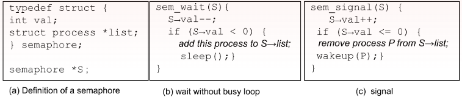
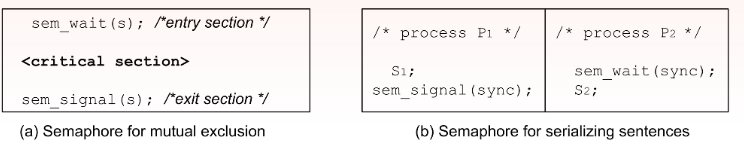
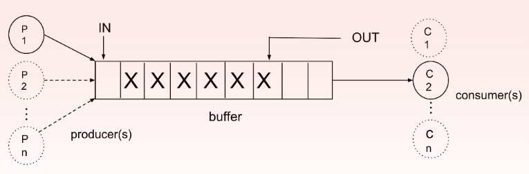
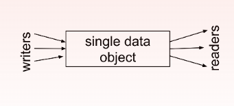
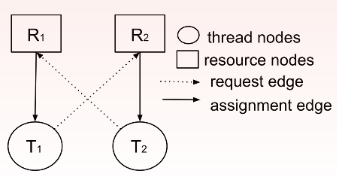
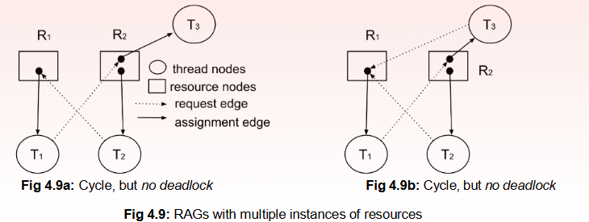

#### Syllabus
----
1. [Process Synchronization](#1.Process-Synchronization)
2. [Race Conditions](#2.Race-Conditions)
3. [Critical Section Problem](#3.Critical-Section-Problem)
4. [Mutex Locks](#4.Mutex-Locks)
5. [Peterson’s Solution](#5.Petersons-Solution)
6. [Semaphores](#6.Semaphores)
7. [Monitors](#7.Monitors)
8. [Synchronization Hardware](#8.Synchronization-Hardware)
9. [Synchronization Problems](#9.Synchronization-Problems)
10. [Producer-Consumer Problem](#10.Producer-Consumer-Problem)
11. [Dining Philosophers Problem](#11.Dining-Philosophers-Problem)
12. [Readers-Writers Problem](#12.Readers-Writers-Problem)
13. [Deadlocks](#13.Deadlocks)
14. [Resource Allocation Graphs](#14.Resource-Allocation-Graphs)
15. [Deadlock Prevention](#15.Deadlock-Prevention)
16. [Deadlock Avoidance – Banker’s Algorithm](#16.Deadlock-Avoidance-%E2%80%93-Banker%E2%80%99s-Algorithm)
17. [Deadlock Detection](#17.Deadlock-Detection)
18. [Recovery from Deadlock](#18.Recovery-from-Deadlock)


## 1.Process-Synchronization
---
All the cooperating processes either share data through them or modify them. It may happen that more than one process attempts to simultaneously access the same data-structure (or shared variables) at the same time. Simultaneous read of a given shared data by several processes may lead to a contention in a single processor system as to who gets the first chance to read. Even though this is a scheduling issue, it is not a serious problem. All processes are supposed to read the same value of the variable or face the same state of the shared data structure. But when simultaneous read and write attempts are made or simultaneous writes are attempted on a shared data item by more than one process - their execution order has serious implications.

But coordination or synchronization among the cooperating processes is necessary to ensure that simultaneous reads & writes are properly serialized to mitigate undesirable program behaviour. It is one of the most important issues in concurrent programming (refer Sec 1.2.3 and Sec 1.3.8) that needs to be taken care of either by the application developers or the operating system.

In a non-preemptive uniprocessor system, a process is allowed to execute as long as it wants until it voluntarily leaves the processor. Only one process gets the chance to use CPU and complete the read or write operations at a given time unhindered. Hence, this kind of erroneous sequence is not supposed to occur unless there is a mistake within the process committed by the programmer. In a non-preemptive multiprocessor system, however, speeds of the processors also need to be taken into account. Scheduling cooperating processes on different processors with different computing speeds can create serious synchronization issues.

The problem can aggravate in a preemptive scheduling system because a process can be preempted while it is in the middle of a write operation. The write may not be complete before the preemption and another cooperating process may read the same data unaware of the preemption. If the read is supposed to happen after the write, but the write is not complete, and the reader is not aware of it - this leads to the problem of data inconsistency. The reader will get wrong data which can lead to further undesirable effects.

## 2.Race-Conditions
---
Race conditions happens when two or more process write at the same time, Then it is a case of simultaneous writes. This type of simultaneous write can lead to multiple possible values if it happens in parallel or it will be one or the other values that can be possible in simultaneous writes.

## 3.Critical-Section-Problem
---
 the update needs to be indivisible or atomic, i.e., if it has started, it must be complete, or it should be rolled back and should start afresh. The problem occurred as preemption was allowed within an update of a shared variable. Operating systems must ensure that shared variables are updated in an atomic manner - preemption should not happen while shared data is being modified. The section of code where a shared data is accessed is thus very critical - the section is called a critical section (CS). For example, where a database file is updated is a critical section. 
 
When a shared variable is accessed in a process, the first instruction with which the access begins marks the start of a CS and the instruction where manipulation is complete marks the end of a CS. For a given shared variable, there can be several CS for it within a process. Also, for the same shared variable, there can be different CS in different processes. The length of a CS can vary depending on the type of data structure and its manipulation type. A process can have several critical sections related to a single or multiple shared objects.


Let us consider a system of n processesܲ  P0,P1,P2,....P(n-1) sharing at least a shared data item among them. Each of the processes has a critical section where the process accesses or modifies data that is shared with at least another process. As already discussed, no two processes should be allowed to access the CS at the same time. Any process that wants to access a CS must make a request to enter the CS. If there is no other process executing the CS, the requesting process will be allowed to enter the CS, otherwise it needs to wait. The section of code where the request is made, and the process is granted permission or needs to wait is called an entry section. Every CS will be preceded by an entry section. Similarly, when the execution of a CS is done by a process, some bookkeeping jobs need to be done, so that other processes waiting for permission to enter the CS, can enter in their CS. This portion of code where book-keeping work is done just after a CS is called an exit section. Every CS will be followed by an exit section. Other portions of the code in each of the processes are called the remainder section.

Any good solution to the critical section problem must have three following properties:
- **Mutual Exclusion**: One  and only one process is allowed to execute in a critical section corresponding to a shared data object at any time. In other words, access to the CS is done mutually exclusively. This is also known as the safety property
- **Progress**: If no process is executing in a CS, but some other process(es) want(s) to enter the CS, then the processes which are not in the remainder section (that means processes in either entry or exit or critical sections) will decide which process can enter in the CS next. Also, this decision must be taken within a bounded time. This is also known as finite arbitration or liveness property.
- **Bounded Wait**: Once a process has made a request to enter a critical section, there must be a limit or bound on how many times other processes can be allowed to enter the CS before the requesting process is granted access to enter the CS. This is also called the property of starvation freedom

## 4.Mutex-Locks
---
Each access to a critical section is to be ensured in a protected manner, ***Only one process should be allowed at a time to access a critical section shared by many processes***.  If some shared data is updated, then it should be done in an atomic way (either update should be complete or not done at all). While the update is in progress, no other processes should interfere but wait till it is complete. In other words, access to critical sections is to be done mutually exclusively.

Mutex is the acronym of mutual exclusion. A mutex lock is a simple synchronization tool designed to ensure mutual exclusion of two or more processes sharing a critical section. It can be thought of as a simple data structure containing a boolean variable, say avail. The var avail is initialised as true. A mutex lock allows two simple operations: acquire() and release(). The mut_lock is acquired (only if avail is true) by a process before going into a CS, and released (avail is set to true) when the execution in the CS is done (Fig 3.19). Operation acquire() resets the variable avail (=false) so that other processes that want to execute CS loops around in the busy wait condition. However, if a process that holds the lock releases it, another process can acquire and go into the CS.

- The two operations acquire() and release() are considered atomic. They can be implemented using hardware primitives like TSL or CAS. 
- This type of mutex locks has a busy-wait loop where a process intending to go into CS loops around. These are also, therefore, called spinlocks. Spinlocks are not good from the performance point of view. Nonetheless, spinlocks are beneficial when critical sections are very small needing mutual exclusion for only short duration.

## 5.Petersons-Solution
----
Two flag variables are introduced in the peterson's solution to 2-process CSP(this only works for only 2 concurrent process).  It allows **two processes** to share a **critical section** without leading to **race conditions**. It ensures **mutual exclusion, progress, and bounded waiting**—the three necessary conditions for a synchronization algorithm.

We use two **variables**:
1. `flag[2]` → A boolean array where `flag[i] = true` means process **Pi** wants to enter the critical section.
2. `turn` → An integer variable indicating whose turn it is to enter the **critical section**.
```go
// Peterson's Solution in Golang
// Process P0
do {
    flag[0] = true;   // P0 wants to enter critical section
    turn = 1;         // Give turn to P1

    while (flag[1] && turn == 1);  // Wait if P1 wants to enter

    // Critical Section
    // Perform shared resource operations

    flag[0] = false;  // Exit critical section
} while (true);

// Process P1
do {
    flag[1] = true;   // P1 wants to enter critical section
    turn = 0;         // Give turn to P0

    while (flag[0] && turn == 0);  // Wait if P0 wants to enter

    // Critical Section
    // Perform shared resource operations

    flag[1] = false;  // Exit critical section
} while (true);

```

- **Mutual Exclusion:** Only one process can enter the **critical section** because the other process is forced to wait.

- **Progress:** If one process is not in the **critical section**, the other can proceed.

- **Bounded Waiting:** The `turn` variable ensures that neither process gets **stuck forever** waiting.


## 6.Semaphores
---
Semaphore are an improved version of mutex locks. A semaphore S is an integer value that can only be accessed **by two atomic function *wait( )* and *signal( )***. The semaphore integer variable (val) keeps track of simultaneous access to a critical section that can be allowed. It is initialized with an integer indicating maximum of such simultaneous accesses (often simultaneous reads to a CS data item is allowed, but simultaneous read & write are to be done mutually exclusively).

***wait( )*** allows the use of semaphore and decrements the val. When no more simultaneous access is allowed (val <=0), a process spins in busy-wait. 

***signal( )*** increments semaphore value to allow other waiting processes to use the semaphore. wait() is also known as down() or P().

*==Definition of Semaphore==*
```c
typedef struct {
int val;
}semaphore;

semaphore S;
```

==*Waiting with busy waiting*==
```c
wait(S){
	while(S.val <= 0);
	/* wait till the s.val > 0 (resource is free) */
	S.val --; /* acquires the resource */
}
```

==*Semaphore Release*==
```c
Signal(S){
	S.val ++;
}
```

#### Semaphore types

There are two types of semaphore:

- A ***counting semaphore*** allows multiple but limited number of processes to simultaneously access a shared resource (including reading). When non-negative, the semaphore value represents how many more processes can still be allowed to simultaneously access a shared resource. When negative, semaphore shows the number of processes waiting to access the shared resource. 

- A restricted type is the ***binary semaphore*** that is like a mutex lock. Its val thus can be 0 or 1. However, mutex lock (or spinlock) is different from binary semaphore in that mutex requires the same process to unlock it that locked it. On the other hand, binary semaphores are operated by any process that has access to it (not necessarily the same process).

#### Implementation of a semaphore 

As mentioned earlier, ***busy-wait is a wastage of CPU time***. Instead of spinning, a process can rather block and have a context switch to let other processes execute when its competitor(s) are executing in CS. The semaphores, therefore, get rid of busy wait loops by maintaining a list of such blocked processes. Necessary changes in the implementation are shown below.



**A semaphore is always initialized with a non-negative integer. Then its value is inspected and updated only by two functions. In the wait function sem_wait(), semaphore value is decremented first and then the calling process is blocked, if the semaphore value becomes negative**. 
***The blocked processes wake up only through a call of signal function (sem_signal()) invoked by some other process. In the signal function, semaphore value is incremented first and if it becomes non-positive (≤ 0), a blocked process is woken up and allowed to continue(i.e, if it's negative a process is waiting for the resource therefore woke them up else if it's positive no process is waiting for the resource).*** The list of processes is implemented using a pointer to the linked list of PCBs of blocked processes. The two functions sem_wait() and sem_signal()must be executed atomically. In other words, these functions can also be considered critical sections for a semaphore. Hence, they must be implemented using disabling interrupts (Sec 3.7.1.2) or CAS or mutex locks. 

Semaphores are offered by OS to ease the job of synchronization for application programmers. Primary use is in mutual exclusion of a critical section (CS) among a set of cooperating processes. A binary semaphore s is initialized with value 1. The process that wants to execute a CS, calls sem_wait(s) in the entry section. If no other process is in CS, it can go into the CS. In the exit section, it calls sem_signal(s) to let others go. The code looks simpler and tidy from the application programmers’ end. A binary semaphore can also be used for ensuring serialization of events, tasks or statements. Suppose we want to ensure that statement S1 of process P1 need to execute before the statement S2 of the process P2 where both processes are running concurrently. We can do the following implementation using a semaphore sync, initialized to 0. Since sync has initial value 0, P2 will block due to sem_wait( ) and cannot execute S2 in P2. Once S1 in P1 is executed and then sem_signal( ) increments the semaphore sync, S2 in P2 can execute.


Counting semaphores are often used for managing simultaneous access of a resource by more than one process. A counting semaphore can keep track of the accesses to resources that have multiple instances like scanners, printers, shared buffers, files etc. and can stop further attempts when the maximum limit is reached. We shall soon see more use of semaphores in solving some of the classical critical section problems.

## 7.Monitors
---
Monitors are more powerful and sophisticated tools than critical regions provided by programming languages. They can be considered as abstract data types (ADT) that encapsulate both data and methods, resembling objects in C++ or Java. A user can define her own monitor based on her need using the prototype as given in Fig 3.24a. Each monitor has the provision of defining a set of shared variables that can represent the states of the monitor, a set of condition variables whose values determine the progress of the monitor, and a set of functions that can be executed in a mutually exclusive manner. A process enters a monitor by invoking a function or method within it. Within an invoked function, the parameters, shared variables and condition variables defined can be accessed. A condition variable here is like that in a conditional critical region. The variable determines whether to proceed in execution of the monitor-function that it is executing or to block, based on the value of the variable. Since only one of the monitor functions is active at a given time, and no other functions from the same monitor can be active that time, several processes can wait or block to enter a given monitor. Again, within a monitor-function, a process can check a condition variable and block itself. This condition variable is a shared variable on which several processes can block. Hence, there can be two sets of blocked processes. One set of blocked processes have not entered the monitor (called inactive processes) and another set of processes that are within the monitor (and hence, active) but blocked on condition variables. Inactive processes can enter a monitor when no other processes are active in the monitor. They are not directly dependent on any control variable. 

Each condition variable x within a monitor is associated with two functions: x.wait() and x.signal(). Very much like a semaphore, x.wait() blocks an active process running within a monitor. x.signal() wakes up a blocked active process, if any. If there are no blocked processes, x.signal() does not have any effect (unlike normal semaphore). However, once a x.signal() is invoked by a process (say A) and there is a process (say B) waiting on x.wait(), a pertinent question is: which process can start execution inside the monitor immediately? There are two possible answers as strategies given below. 

1. Signal and wait: Process A signals and then waits until B completes execution in the monitor. 
2. Signal and continue: Process A signals and continues while process B waits until A completes execution in the monitor. 

Any one of the strategies is followed in an implementation. However, both have their advantages and disadvantages and are used in different implementations. Java, C# support monitors.

## 8.Synchronization-Hardware
---
Some synchronization services are obtained from the basic hardware like the memory units, processors and/or interrupts. 

#### Atomic memory operations

Memory cells store the data which are read and written through machine instructions executed by the processor. Simultaneous access to different memory locations does not cause any synchronization issue, but on the same memory location may do. In a uniprocessor system, only one instruction can be executed by the processor at a single point in time. After invoking a memory read or memory write operation, the CPU stalls or blocks the process. It does not proceed until the memory operation is over. Hence, no other instructions from the same process can invoke the same memory access in a non-preemptive kernel.

In a preemptive system, the CPU can go to other threads or other processes that can attempt to read or write from the same memory location. However, even in a preemptive kernel, only one memory operation is generally allowed at a time. When one memory read / write is going on, other attempts to the same memory location are blocked by the hardware. Another memory operation by the same or another process is allowed only after the current one is completed. Simultaneous attempts to memory access are, however, serialized in an arbitrary manner - whoever executes the memory operation instruction first, gets to access the memory. The memory operation is atomic - i.e., if it is started, the memory access hardware ensures that it is done in a mutually exclusive manner.

#### Disabling Interrupts

One solution to stopping simultaneous attempts for accessing the same critical section can be dis-allowing preemption, i.e., not allowing any interrupts to occur during CS execution. However, disabling interrupts can only be done in kernel mode. Hence, user processes cannot implement it in user mode. Kernel processes can implement it by disabling interrupts from devices, timer or other processes (traps) in the entry section before going into the critical section. Again, after execution in CS is over, the process enables the interrupt so that interrupts from timer, other devices and processes can happen. Also, another kernel process can disable interrupt and enter the CS.

This scheme ensures mutual exclusion, but not progress and bounded wait. More than just disabling and enabling interrupts needs to be done in entry and exit sections respectively to achieve other properties. Also, disabling interrupts for long due to a lengthy critical section can be detrimental to the system performance, as it under-utilizes the peripheral devices and reduces concurrency.

although the scheme can be easily implemented in a uniprocessor system, it will be very difficult to implement in a multiprocessor system. Ensuring mutual exclusion in a multiprocessor system needs blocking other processors whenever attempts to access the same critical section is made. This is non-trivial. Hence, even if we implement interrupt disabling, we need other synchronization mechanisms, especially for multiprocessor systems.


### Extended Hardware Solutions

#### test-&-set lock (TSL)
testAndset() is an instruction that tests and returns the value of its argument (type boolean) and sets its value if it was originally false. If two or more processes attempt to execute testAndset() simultaneously, the instructions will be run atomically, but in an arbitrary manner. Whoever gets the first chance, will be able to set val. Others can check that it is already set.

#### compare-&-swap (CAS)
compareAndswap() is another hardware instruction that compares values of two arguments (target variable with an expected one) and if they are equal, sets to a new value (third argument) and returns the original value of the target variable. CAS deals with integers.

#### Atomic variables
Synchronizing instruction like CAS is not typically used directly for mutual exclusion. Rather, CAS is more used in implementing atomic increment or decrement of a variable. The function can be implemented in the following way. The value var is decremented only once by only one process that tried to execute the CAS first. The increment can also be done in the same manner. This implementation can ensure atomic updates: no two processes can update at the same time.

## 9.Synchronization-Problems
---
With necessary background on the interprocess communication, synchronization, critical section problems and their solution attempts using different synchronizing tools, we discuss a few classical IPC problems where there are a few CSPs. Let us describe the problems and their solutions.

## 10.Producer-Consumer-Problem
---
This is a classic problem found in many systems across the domains where a component produces some items or objects and stores them in a place one after another from where they are picked up (or consumed) in the same order by another component of the system downstream (Fig 3.28). The buffer is accessed in FIFO (first-in-first-out) manner. The producer-consumer problem can have different forms and flavours as given below. 

Based on the IPC mechanism, it can follow 
- ***Synchronous communication***: the producer produces only when the consumer is ready to consume. 
- ***Asynchronous communication***: the producer(s) produces at its own speed and puts the items in a buffer from where the consumer(s) picks them at its own speed.

Depending on the buffer type, the problem may have 
- ***Unbounded buffer:*** The producer produces without any bound or limit and puts items onto a buffer of infinite capacity. 
- ***Bounded buffer:*** Buffer size is fixed; the producer stops when the buffer is full. It can only resume when at least one item is consumed from the full buffer.

The producer and consumer can simultaneously access the buffer asynchronously. As long as the buffer contains some items, there will not be any problems. However, *the producer must stop when the buffer is full and loops around in a busy-wait state. Similarly, the consumer must be in busy- wait when the buffer is empty.* These two extreme cases lead to wasteful busy-wait CPU cycles. However, that can be avoided with the use of semaphores. Also, the bounded buffer is concurrently accessed by both the producer and the consumer.

## 11.Dining-Philosophers-Problem
----
Five philosophers (numbered as 0, 1, 2, 3, 4) are sitting around a round-table to dine with spaghetti (an Italian food). They primarily think but attempt to eat when they feel hungry. Each philosopher has a private plate but there are only five forks. Assume, each philosopher needs two forks (both left and right) to eat and thus not all of them can eat at the same time. But when a philosopher finds two forks available beside her, she picks them up, eats some, (washes and) puts down the forks and starts thinking again. 
The problem states: can we devise an algorithm that all the philosophers can complete dining without any issues or difficulties?

It represents a class of synchronization problems where a subset of the cooperating processes (or threads) can share a limited number of instances of some shared resource(s) to do some job, but not all the processes at the same time. How to serialize their accessing the resource(s) so that all the following properties like 

1. mutual exclusion, whenever it is required, is maintained,. 
2. there is no starvation (every intending process can access the resource) and 
3. there is no deadlock (there is no stalemate). 

As the problem states, no two philosophers can use the same fork simultaneously. In other words, forks are to be used in mutual exclusion.

Let us consider the following shared variables. 
n = number of forks (originally n = 5) and an semaphore fork [n] = {1, 1, …, 1}; (binary semaphores, all initialized to 1).

Each philosopher picks up first the left fork and then the right fork, eats for some time and then puts down the fork in the same order (left followed by right). When the philosophers attempt to grab the fork, certainly mutual exclusion will be ensured. If one philosopher can grab both the forks, she can eat as well

 in an extreme case, there is a possibility that each philosopher picks up the left fork first and before the right can be picked up, her neighbour picks it up. This leads to a situation where everyone has left fork on their left-hands and their right-hands are empty, nobody can eat and there is a complete stalemate or deadlock. The problem can linger forever unless there is preemption of resources externally. Hence the problem is not deadlock-free

There can be starvation-free and deadlock-free solutions imposing some restrictions like 
1. There should be entry for a maximum of (n-1) philosophers when there are n forks, OR 
2. n is even and we ensure that even-numbered philosophers (numbered 0, 2, 4, …) pick up left forks first and then right ones, while odd-numbered philosophers pick up right forks first followed by left, etc.
## 12.Readers-Writers-Problem
---
This is another classical synchronization problem. Even though it has resemblance with the producer-consumer problem, here the shared object is treated as a single unit. The unit can be a database record, a file, a memory block or even a set of processor registers.

The shared unit can be read simultaneously by several processes (or threads) without any harm but cannot be concurrently read & written. Also, simultaneous writes cannot be allowed,

Hence mutual exclusion is needed between read and write as well as between simultaneous write attempts. Also, the problem has two variations based on the priorities between the readers and the writers. If one or more readers wait along with one or more writers: either the readers can be given priority or the writers.


no reader should wait unless a writer has already accessed the critical section. It allows simultaneous reads and counts the readers using a shared variable r_count (initialized to 0). The reader process first increments r_count and then checks its value. If it is the first reader, it should stop any writer and thus invokes wait for binary semaphore rw_mutex/

The writer process is simple. It does write in mutual exclusion to read. If any reader is already within the CS, it waits. As the readers have the priority, the writers may wait indefinitely causing starvation to writers. Hence, mutual exclusion is maintained in the solution, but not progress nor bounded-wait for the writers.

# 13.Deadlocks
----
In operating systems, deadlock is a serious problem caused by concurrent execution of processes (or threads). It refers to a situation where a set of concurrent processes (or threads) perpetually block or starve for want of some resources held by some other processes (or threads) within the set. The processes (or threads) cannot come out of the situation on their own.

Concurrency offers increased CPU utilization and throughput, Only if the processor has multiple cores true parallelism can be achieved. It also leads to additional challenges like race conditions due to attempt of concurrent execution of critical execution. 

But the issue of deadlock is more general and pervasive. The processes (or threads) involved in a deadlock cannot proceed any further (not only execution of critical sections but non-critical sections as well). Deadlock is characterized by the following: 
1. it is caused for the want of computing resources (of any type). 
2. nature of starvation is perpetual. 
3. starvation occurs to more than one processes (or threads) simultaneously. 
4. the set of processes (or threads) have dependencies on each other in such a manner that they cannot come out of the perpetual stalemate on their own. 

A deadlock differs from a livelock in the starvation. In a livelock starvation is not permanent and the entities involved in the livelock can resolve on their own without necessarily requiring external efforts.

**Livelock**: A situation where two or more processes continuously **change state** in response to each other but **do not make progress**. Two processes constantly trying to avoid a deadlock by releasing and re-acquiring resources, but they keep interfering with each other.

### Resources

A computing resource can be any object (hardware or software) that a process (or thread) requires to complete its execution. Hardware resources can be processors, network cards, memory elements, I/O devices; software resources can be files, shared objects (In UNIX, .so files), sockets, messages or synchronization tools like semaphores. mutex locks.

### Resource access 

Threads need resources for completing their tasks. During execution, a thread needs and uses several resources. However, the uses always obey the following sequence. 

1. Request: A thread makes a request to the OS kernel for one or more instances of a resource. If an instance of the resource is not available, the kernel cannot grant it to the thread immediately. The thread waits (or blocks) till it acquires an instance of the resource. 
2. Use: Once acquired, the thread uses the instance of the resource non-shareably. 
3. Release: After the use, the thread returns the resource back to the kernel. 

In most cases, both request and release are system calls. Use may be in user or system context. If the resource is a mutex lock or a semaphore, use can be executing a critical section guarded by the mutex lock.


### 14.Resource-Allocation-Graphs 

Concepts from Graph Theory help understand and define deadlocks precisely. Resource allocation to threads can be modeled as a heterogeneous directed graph having two types of nodes (resources and threads) and two types of edges. A thread requests for a resource of a particular resource-type - it is represented by a claim edge or a request edge from a thread to a resource. When the request is granted, the thread holds the resource - it is represented by allocation edge or assignment edge. Such a representation is called a resource allocation graph.

### CONDITIONS of a DEADLOCK 

With the technical background given above, we can now define a deadlock more precisely. A deadlock can occur if all the following conditions are satisfied simultaneously. 

1. **Mutual Exclusion** in use of resources: When resources are used by threads non-sharably, then only there may emerge a possibility of deadlock. There should be at least one resource that is used by threads in a mutually exclusive way - i.e., only one thread can use an instance of the resource at a time. If another thread wants to use the same instance of the resource, the thread needs to wait till the first thread releases the resource. 

2. **Hold and Wait** for resources: During execution, threads are allowed to hold one or more resources and, at the same time, request to acquire a few more resources held by other thread(s). 

3. **No Preemption of resources**: None of the resources are preempted from the threads that hold them. A thread releases the resources voluntarily when either their need is over, or the thread terminates. 



4. **Unresolvable Circular Wait:** A set of threadsܶ  **T = {T₁, T₂, ..., Tₙ}** A set of resources: **R = {R₁, R₂, ..., Rₙ}**. - **R₁ → T₁**: Resource R₁ is _assigned_ to T₁ **T₁ → R₂**: T₁ is _requesting_ R₂, **R₂ → T₂**: R₂ is _assigned_ to T₂, **Rₙ → Tₙ**, **Tₙ → R₁**: Tₙ is _requesting_ R₁. Formation of the cycle in the RAG (Fig 4.8) is a confirmation of a deadlock when there are only single instances of each of the resources. If the number of instances for even a single resource is more than one, even though there is a cycle - there may not be a deadlock if all the requests can be satisfied.


## 15.Deadlock-Prevention
---
The four methods are:
1. Prevention
2. Avoidance
3. Detection and recovery
4. Ignore (used in UNIX, ignore and restart)


**DEADLOCK PREVENTION**
For a deadlock to occur, each of the four necessary conditions (mutual exclusion, Hold and wait, No preemption, Circular wait) must hold. By ensuring that at least one of these conditions cannot
hold, we can prevent the occurrence of a deadlock.

**Mutual Exclusion**
- Make all the non-sharable resources sharable.
- Make all the non-sharable resources sharable. • The mutual-exclusion condition must hold for non-sharable resources. For example, a printer cannot be simultaneously shared by several processes.
- Sharable resources, on the other hand, do not require mutually exclusive access, and thus cannot be involved in a deadlock.
- Read-only files are a good example of a sharable resource. We cannot prevent deadlocks by denying the mutual-exclusion condition because some resources are intrinsically non-sharable and mutual exclusion is one of the requirements of the critical section problems solution.

**Hold and Wait**
- ***A process may not request a resource if it is holding another resource.***
- So, to take the print out of the contents of a file, you first request the disk, and then you get it, use it and release it.
- Then you request the printer, you get it, use it, and then you release it.
- Thus, it implies that a process should have released all its resources before it requests for additional.

**No preemption**
**1.** If a process is holding some resources and requests another resource that cannot be immediately allocated to it (that is, the process must wait), then **all resources currently being held are preempted**.

- In other words, these resources are implicitly released.
- The preempted resources are added to the list of resources for which the process is waiting.
- The process will be restarted only when it can regain its old resources, as well as the new ones that it is requesting.

**2.** Alternatively, if a process requests some resources, we first check whether they are available.

- If they are, we allocate them.
- If they are not available, we check whether they are allocated to some other process that is waiting for additional resources.
- If so, we **preempt the desired resources** from the waiting process and allocate them to the requesting process.

**Circular Wait**
- For avoiding circular wait, we use a **numbering scheme**.
- We can assign a **number for all resources**.
- So each process has to request resources in a **particular order**.