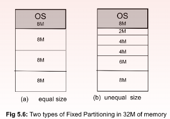
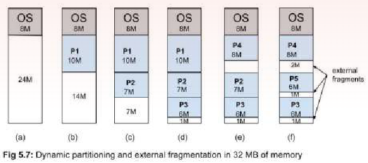
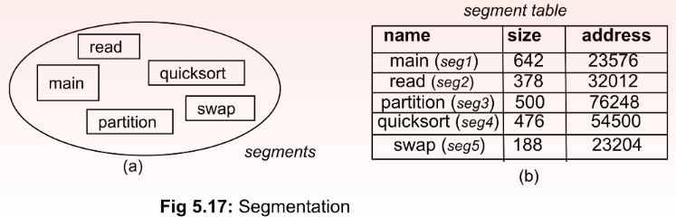
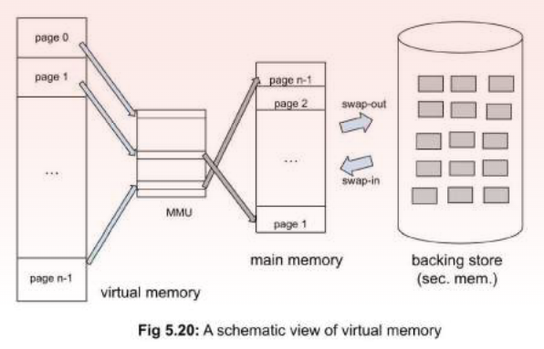

#### References
 - Virtual Memory: https://www.youtube.com/watch?v=A9WLYbE0p-I

## Introduction
----
A processor constantly interacts with the memory during execution. while all the programs persistently remain in secondary (HDD), they are temporarily bought into main memory for execution. The processor can fetch (and store) instructions and data from (to) the main memory and not from secondary or tertiary storage. Hence all process are loaded into the memory.

 Main memory is the furthest memory unit from a processor that it can directly access which can accommodate the OS as well as user applications during their execution. Processors make all memory references with respect to this memory. Main memory is volatile in nature - it keeps the code and data (both for system and application programs) as long as the computer is on. Hence, both the OS and other programs need to be loaded on the main memory (hereinafter referred to as memory only) from the secondary or tertiary memory after each start-up and/or execution 

**The OS kernel remains loaded in the low memory region of the memory as long as the system run**

Once loaded, the OS divides the memory into two parts: 
1. kernel space for storing the OS; and the 
2. user space for storing the application processes

 In a single-programming system, **the OS remains in the kernel space** and only one application program can reside in the user space. But **in today’s multi- programming environment, the OS needs to further divide the user space so that several user programs can coexist in the memory**

How many programs can be accommodated in the memory decides the **degree of multiprogramming**. 

CPU usage can be maximized if we can accommodate in the memory as many processes as possible. But the main memory is much smaller compared to other permanent storage devices. If a process with a large address space is loaded in the memory, it potentially precludes loading of other processes, reducing the degree of multiprogramming. Can a process be partially loaded? If yes, how much of it is to be loaded now, when and where is the remaining portion to be loaded later?

### Memory Allocation
---
If a program is large, requiring more than available memory, it cannot be loaded entirely. In the earlier days (single programming environment), the application developer had to decide which part of the program would be loaded at a given time.

The program had to be designed into several parts (modules) so that the main module with a currently executed one along with its necessary data fit in the available memory. 

<mark style="background: #FFF3A3A6;">When another module needed to be loaded, it used to replace the in-memory counterpart from the secondary memory. This technique is called **overlaying**</mark>

three basic schemes. 
1. Contiguous Allocation: a process in its entirety is allocated contiguous memory space .
2. Paging: a process is divided into a number of equal sized pages; pages are loaded .
3. Segmentation: a process is divided into a number of unequal-sized segments; segments are loaded.

### Contiguous-Allocation
----
Here, a process in its entirety is loaded into the memory at one go, if enough space is available, otherwise not at all. The OS divides the available space into a number of partitions and allocates at least one partition to each process in a contiguous manner. 

If no partition is free, but there is a new process ready to be loaded, one of the processes, not ready to run, is swapped out of the partition. partitioning can be done using fixed boundaries or adjustable boundaries as detailed below.

#### Fixed partitioning
The OS divides the available space into a few partitions before actual space allocation to processes. The partitions can be of either equal or unequal size.

***Equal partitions:*** All the partitions are of equal size. **If a process fits within the size, it is allocated a partition, otherwise it is denied**. Either the developer must manage using overlaying or the program is not run at all. 

**Even if a process is much smaller (say, 1M) than the partition size (8M here), an entire partition is allocated to the process**. Since the boundaries are pre-decided and fixed, ***the remaining space (7M here) is wasted as it cannot be used by any other processes. This phenomenon is called internal fragmentation*** as fragments are created within the partitions. 
Equal partitions are easy for the OS to manage as any process can be allotted any free partition if there is one. But the scheme suffers from high number of denials and low memory utilization due to high degree of internal fragmentation.

**Unequal partitions:** Internal fragmentation is less severe in unequal partitions, as each process can be allotted a partition that is just enough to accommodate it, leaving minimum possible waste space. 
However, to implement it effectively, each partition should have a scheduling queue of processes based on the partition size, i.e., smaller processes (say 2M) will be in a queue of 2M partition, larger processes (6M < size < 8M) in a queue for an 8M partition, and so on. 
This scheme can reduce internal fragmentation with an increased overhead of extra queues. Also, this may cause denial to a process when several partitions of different sizes are free except the one the process is waiting for.

#### Variable-Partitioning
Here the partitioning is not done apriori but done at the time of space allocation. As the processes arrive, available space is allocated to them from one end of the memory exactly as per their need. When no more space is available, either the new process is denied, or a not-ready process is swapped out.
The partitions are thus dynamically created. They are of variable sizes. However, when processes leave the memory or are swapped out, new processes need not be of the same size. ***When a new process of smaller size replaces an old process, the boundary comes closer, and a ‘hole’ is created in memory.***

The partition gets smaller, and the fragmentation is outside the partition. This phenomenon is different from internal fragmentation discussed in fixed partitioning and is called ***external fragmentation***.

***For example**, suppose in a memory of 32 MB, the OS occupies 8 MB space leaving 24 M space free (Fig 5.7a). A process P1 of size 10M arrives and is allocated space (b). Similarly, P2 and then P3 arrive and occupy (c-d), leaving 1M of space. Now, process P4 of size 8M comes but there is not enough space. P1, the only process that occupies the space large enough is then swapped out (assuming it was not running). P4 takes 8M of space, leaving 2M empty (e). Similarly, P5 leaves another 1M hole (f). **Now, suppose a process P6 with say, 3M size arrives. Even though we have 4M space empty, but not contiguous. Hence, P6 cannot be allocated space due to external fragmentation.*** 

How can the issue of external fragmentation be effectively managed, as it keeps on increasing with continuous arrival of newer processes? Two popular solutions applied are: 
1. compaction and 
2. placement algorithms

***Compaction***: Processes are pushed towards one end of the memory and small holes are acquired and added to make a bigger hole. Compaction routine is run by the OS to reclaim the wasted space at regular intervals or when memory utilization falls below a pre-decided threshold. This is like the defragmentation utility that Windows systems provide as ‘Disk Defragmenter’ to make the hard disk drives organized in a compact way and to free some disk space.

***Placement Algorithms:*** Another way out to minimize the fragmentation is done while placing new processes into the available holes. The OS maintains a list of available holes with their sizes when processes leave the memory. Before a new process is allocated space, the search is made on the list to find the most appropriate hole. There are different algorithms for allocating holes to the requesting processes. The strategies discussed below are some of them. 

1. ***First-fit:*** A process is allocated the first hole that is found large enough to accommodate it. It is quick to place the processes but suffers from potential external fragmentation. 
2. ***Best-fit:*** A process is allocated the smallest hole, after exhaustively searching the list, that is just large enough to accommodate the process leaving the smallest empty space. It ensures the lowest fragmentation. 
3. ***Worst-fit:*** A process is allocated the largest hole, after exhaustively searching the list, that can accommodate the process. Even though it seems counter-intuitive at the first instant, it takes away the remaining space after allocation and adds to the list of empty holes

### Segmentation
----
**Segmentation is another non-contiguous memory allocation technique where space is allocated to processes in the units of logical blocks or segments from a user’s perspective.** Any program can be considered as a collection of logical segments. ***For example, a C- implementation of quicksort algorithm may have the following logical sections: functions main(), read(), quicksort(), partition(), swap() etc. and data section. Each of the functions and data sections can be considered as a segment and they can be independently loaded onto the memory*** (Fig 5.17a). 

Each segment is assigned a number (numbering is not done by the OS, but by either the compiler, linker or loader) and any memory reference in the logical space is done relative to the beginning of a segment. Hence, logical addresses have the form <seg-id, offset> where seg-id represents segmentation id and offset is the location of the address from the base-address of the segment. Base-addresses of all the segments are maintained in a segment table by the OS

### Paging
----
**Memory is divided into several small blocks of equal size**. For the convenience of address translation and data transfer, block-size is kept in the power of 2, like 1024 bytes (1K), 4K, 1MB or higher. **The blocks in the (main) memory are called *frames***. **Program code and program data residing in the secondary device are also considered a sequence of blocks of the same size, called *pages*.** Processes are loaded in units of pages into the available frames. The frames need not be allocated contiguously in the memory.

### Virtual-Memory
---
**Virtual memory allows partial loading of a process to begin its execution.** The OS thus starts by loading only the initial piece of the process (a few pages or a segment) to the memory that includes the initial set of instructions and the data that it refers to. This portion of the process that is in the memory is called the ***resident set of the process***.

Execution goes smoothly if memory references are within the resident set. However, when the references are beyond it, as flagged by the page table or the segment table, an software interrupt is generated indicating a memory access fault.

The OS then suspends the ongoing process and puts it in the waiting state. The OS also issues a disk I/O request to bring the page or the segment corresponding to the logical address that caused the memory access fault. 

Once the demanded piece (page or segment) is brought to the memory, an I/O completion interrupt through the processor notifies the OS. The OS then places the blocked process to the ready queue to resume its execution. When there is not enough space in the main memory, some piece of the process address space is replaced to the backing store of the secondary memory.

As shown in Fig 5.20, ***a portion of the secondary memory serves as a backing store of the active processes. While some portions of a process remain in the main memory, other portions are stored in a designated area of the secondary memory. This backing store in the secondary memory is what creates the virtual memory. This is also known as swap space.*** During OS installation, a hard disk is formatted with sufficient space for the swap space (usually kept equal to the size of the main memory space or higher).

### simplified version

Every running program will have a virtual memory, these memory will be mapped to physical memory(RAM). These mapping is done by a ***Page Table.*** Every process will also have the page table to map the data.

**Both the virtual memory and physical memory are divided into several small blocks of equal size this is called pages**. This is done to reduce the complexity of the mapping.

![[Os.excalidraw#^group=54WuN45LxmetjpKF8gdqQ|400]]

***A program is not fully loaded into the disk, initial program is loaded in the memory and the rest are stored in the Disk. These mapping are also done by the Page Table. Inside the page table the corresponding data/instruction will be marked as inside the disk. When the program needs the data it fetched from the disk and loaded into the memory(if the memory is full, an older data is replaced. this is decided by page replacement algorithms).***

**If the page table says the page/data is on the disk, The CPU raise an exception called *Page Fault.*** The OS handles this Page fault by loading the data from the disk to the physical memory, if the memory is full, Least recently page is replaced with the new page. The previous page is saved onto the disk. These handling of the pages are updated in the page table.

***The page is dirty if the program has written something to it after loading it from the disk.*** ==Only if the page is dirty its content is written back to the disk. because if the contents haven't changed there is no need to write it back to disk.==

Loading the page from the disk is very slow, so in the meantime, the OS executes another process. A context switch happens here.

### Important points
---
- Each program has a virtual memory space.
- physical memory usually means RAM.
- Virtual and physical memory is split into pages.
- Last 12kb (for 4kb per page) is called offset.
- Page table maps the virtual address to physical address.
- One page table per program.
- Page fault is an exception raised when the corresponding page/data 
  is not in RAM.

A page-fault incurs the logistic and temporal cost of several operations: 
1. understanding that it is a page-fault (through a trap) 
2. understanding that the reference is legal, and the page is available in backing store 
3. context switch (suspending the current process and starting another) 
4. searching the page in the backing store (incurs disk seek-time + rotational latency) 
5. loading the page on I/O bus 
6. loading the page on the memory and updating page table 
7. putting the blocked process on the ready queue so that the instruction can be restarted

## Page-Replacement-Algorithms
---
1. ***First In First Out (FIFO)***
   This is the simplest page replacement algorithm. In this algorithm, the operating system keeps track of all pages in the memory in a queue, the oldest page is in the front of the queue. When a page needs to be replaced page in the front of the queue is selected for removal.
   
   ****Example 1:**** Consider page reference string 1, 3, 0, 3, 5, 6, 3 with 3-page frames. Find the number of page faults using FIFO Page Replacement Algorithm.
   
    

2. **LRU (Least Recently Used)**
   **LRU** is a page replacement algorithm that removes the page that has **not been used for the longest time**.Each time a page is accessed, it is marked with the **current time** (or moved to the front of a list).
   When a page needs to be replaced (on a page fault), the page that was accessed **least recently** (i.e., has the **oldest timestamp**) is removed from memory.
3. **LFU (Least Frequently Used)**
   **LFU** is a page replacement algorithm that removes the page that has been **used the least number of times**. i.e, frequency of the page access is counted.
   Each page has a **counter** to track how many times it has been accessed. On a page fault, the page with the **lowest frequency count** is removed.

| Feature        | **LFU**                        | **LRU**                          |
| -------------- | ------------------------------ | -------------------------------- |
| Replaces       | Least recently used page       | Least frequently used page       |
| Tracks         | **Time of last use**           | **Count of total uses**          |
| Assumes        | Recent use → future use likely | Frequent use → future use likely |
| Implementation | Needs timestamps or stack      | Needs counters                   |
| Weakness       | Costly to maintain in hardware | Doesn’t forget old usage easily  |

