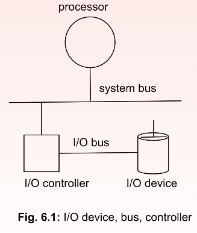
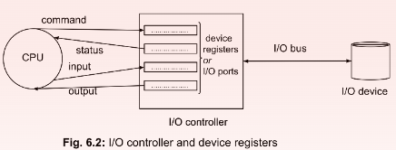
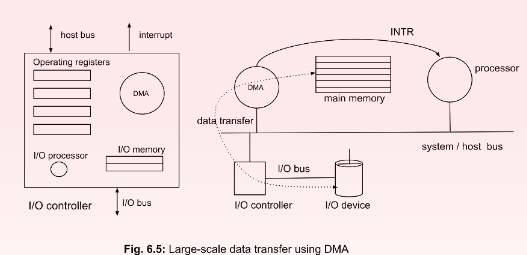

## Device Controller
---
**All I/O devices are connected to the computer through a device controller or I/O controller.** A controller is an electronic unit with different levels of circuits. For example, a serial-port controller can contain a small chip that controls signals on a few wires.

At one side, the controller is connected to the system bus (address bus + data bus + control bus, where each bus is a set of parallel wires to carry address, data and control signals from/to CPU respectively) and on the other side, with the I/O bus (Fig. 6.1). A controller acts as an intermediary between the CPU and the device

Each controller implements a few registers, known as control registers or operating registers or I/O ports. There are four categories of I/O ports (Fig. 6.2): 
1. Command 
2. Status 
3. Input 
4. Output

***The CPU sends the instruction by populating the Command port. It also provides the input data to the device by writing on the Input ports. When the I/O is complete or stops due to error(s), it is notified to the CPU by an appropriate status message written on the Status port. The output of the device, if any, is written by the device on the Output register, which is read by the CPU.*** 

There may be other registers as well, like configuration registers used for configuring the controller during initialization. Again, sometimes, more than one category of ports are merged. These ports exchange data with CPU registers

### CPU - I/O Controller Interaction
---
An I/O controller works on behalf of a CPU to get some I/O operation done by an I/O device. However, the I/O devices widely vary in user interfaces and the controller insulates the CPU from low- level differences. The CPU writes the command on the designated I/O port and input data on the input port, if any, and waits for the completion of the I/O operation intended.

This wait can happen in two ways. The I/O operations are also divided based on the wait-type.

- One, the processor can continuously or intermittently check the Status register of the controller. If the I/O is complete then, it also reads the Output register. The processor remains busy with the I/O operation during the entire interval since issuing an I/O command till its completion (successful or error). This type of busy-wait handshaking is called programmed I/O. 
- Two, the processor populates the command register along and the Input register(s) and goes back to do other activities. When the device completes the intended operation, the controller raises an interrupt request (INTR) to draw attention of the processor. The processor, on receiving the INTR, invokes appropriate interrupt service routine (ISR). The ISR checks the Status register and Output register of the controller and does other necessary work as per the ISR. This option is called interrupt-driven I/O.

Programmed I/O does not need a context switch. It can save time and logistic overhead of context switching. However, it can be used only if the I/O device is quite fast, and the controller responds quickly.

***But, in general, most of the I/O devices are much slower than the processor and hence, most contemporary systems implement interrupt-driven I/O***. When the I/O device takes time to do the I/O operation, the processor can execute other instructions for other processes. The processor and I/O controllers can execute in parallel.

***The processor only needs to check the presence of the INTR signal intermittently. Generally, the processor does it after every clock cycle and addresses the interrupt first, if any, suspending the current process and invoking an interrupt service routine (ISR).*** When execution of the ISR is complete, then either the suspended process is resumed, or execution of another program is started as decided by the ISR.

**In some systems, instead of I/O ports in the controller, a certain portion of main memory is used for I/O control. The CPU can do I/O operations very much like memory accesses (read/write). This kind of I/O activities are called memory-mapped I/O.**

### Direct Memory Access(DMA)
---
In the above scheme, data transfer between the main memory and an I/O device happens through the I/O controller and the CPU. Even for a single byte of data transfer, we need active involvement of the CPU. It sends an I/O read or I/O write instruction to the controller. The controller sends the instruction to the device. The device does the exchange and comes back to the controller with the status and output. Finally, the status and output reach the CPU through the system bus. 

During this time, the CPU either busy-waits or gets interrupted and then runs an ISR. For a large amount of data transfer (say few MBs), this kind of byte-by-byte (or word-by-word) exchange is extremely time-consuming and inefficient as it consumes substantial CPU time. Can we do any better? Direct Memory Access (DMA) exactly does this. DMA is a dedicated processor for large-scale data transfer between two devices without actively involving the CPU. Most modern I/O controllers are fitted with DMA (Fig. 6.5). A host computer can have multiple DMAs for different devices. 

For data transfer between main memory and an I/O device, the CPU is involved in the initial setup. The CPU first arranges a memory buffer for data transfer. It conveys the I/O controller address of the buffer, number of bytes to be transferred and direction of transfer (from or to the memory). DMA transfers the data. Only at the end of transfer, DMA (or the I/O controller) interrupts the CPU. In between, the CPU remains free and can do other execution. Instead of byte-by-byte (or word-by-word) involvement, the CPU is involved only at the beginning and end. However, the DMA transfers the data byte-by-byte or word-by-word or block-by-block. It uses the system bus for the transfer. 

When DMA transfers data of one byte or one word at a time, it uses the host bus in an interleaved fashion along with other activities of the CPU. This intermittent use of the host bus is also called cycle stealing of DMA transfer. DMA can also use burst mode or block transfer mode where DMA uses the host bus uninterrupted. Other devices are not allowed to use the system bus at that time. Obviously, the bus needs to support the burst mode. DMA can also transfer data in a single clock cycle at high-speed bypassing the DMA registers. DMA needs to activate necessary control signals at both the source and the destination. For example, for a secondary memory to main memory transfer, DMA simultaneously enables read signal at the secondary memory and write request to the main memory. This mode of data transfer is called fly-by mode or single-access mode.