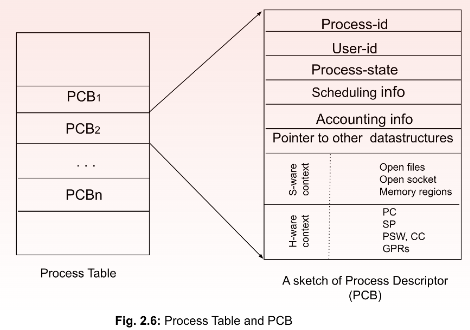
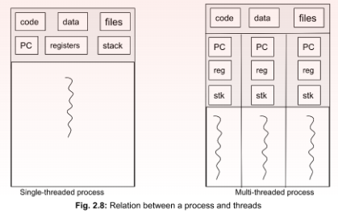
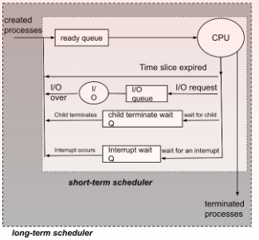

#### Syllabus
---------
1. [Process, Process State](#1.Process-and-Process-State)
2. [Process Control Block (PCB)](#2.Process-Control-Block-(PCB))
3. [Threads](#3.Threads)
4. [Scheduling](#4.Scheduling)
5. Process Scheduling – Basic concepts, Scheduling Criteria
6. Scheduling algorithms - Basics
7. First come First Served, Shortest Job First
8. Priority scheduling, Round Robin Scheduling
9. Operations on processes: process creation and termination
10. Inter-process communication: Shared memory systems, Message Passing

## 1.Process-and-Process-State
---------
![[multiple-process.png]]
When a program is executed, It becomes a process. A process is a program in execution. It is an active entity and dynamically changing. An OS considers processes as units of program execution or simply computation. A process contains application program (sequence of instructions) and data (arguments, variables etc...). A single program can have multiple processes running at the same time on a given machine even if the system has only 1 core.

Some of the processes can belong to application programs or user programs (called user processes), and some OS programs (called kernel processes).

Each process holds some attributes given by the OS as follows.

**Process-id**: a process identifier (pid)
**User-id**: the process is owned by a specific user (uid)
**Process Group-id**: Every process is supposed to belong to a group, based on the task. The group has a process group identifier (or pgid) 
**Address space**: main memory space (known as process address space) where it stores
   1. program (code)
   2. static data 
   3. dynamic data in the form of **heap** and **stack**

Kernel processes reside in kernel space (of main memory), execute OS kernel code in kernel mode, while user processes remain in user space and run user code in user mode and can make system calls 
![[Different_parts_of_process_addressspace.png]]

### Process address space
When a program is executed, It is allocated space in the main memory. The space is called process address space. The space may be physically contiguous or non-contiguous depending on the memory allocation technique used by the OS.
- Text Section: It stores the program code (in executable form, not the source code).
- Data Section: This section stores the data that are used by the process. Some data comes attached to the program code that cannot be dynamically changed (globally declared and initialized as read-only data) - we call this as program data
    - Static data: This data is statically bound to program code and can be allocated space during compilation.
    -  Dynamic data: This data is not allocated during compilation, rather can only be allocated during program execution or in the run-time. It can grow or shrink during execution depending on the requirement of the process. It has two important sub-sections. 
         - a. Heap: During program execution the process dynamically allocates memory (as done by malloc()in Fig. 2.2) based on requirement and deallocates when the need is over.
         - b. Stack: This space is used by the arguments, local variables, return values of a function or a method within a source program. For each function call, stack stores the above variables and data structures for it. 
### Process State
![[process_state.png]]
1. New: This is the first state of a process. When a process is created or a program is invoked the OS creates a new execution context, allocates a process address space in the main memory and other necessary per-process resources in the kernel mode. 

2. Ready: Once the per-process resources are created, the process becomes ready for execution. It needs a processor (actually, a core of a processor, to be specific) to be allocated. 

3. Running: As soon as a processor is allocated, the process starts executing the instructions from the program text. Here, the program can run in user mode, However, for privileged instructions, it can go to kernel mode also. 

4. Waiting: When the process needs an I/O to be done or explicitly waits (via a system call like wait()), the process is taken off the processor and is considered to be waiting. When the I/O is complete or the explicit wait is over, the process becomes ready and joins the ready queue. It can run only when it is allocated to the processor. 

5. Terminated: When the process completes normally (even abnormally also), process address space is reclaimed by the OS. All process-related resources are also de-allocated. This state is called a terminated state.

### Process Context
After a process is created, it changes its states from one to another as it proceeds in its life cycle. Along with the states, there are several other parameters of a live process that the OS kernel has to keep track of. For example, which instruction a process is currently running and thus where the CPU will find the next instruction from (remember program counter or PC), how many special purpose registers (SPRs) like stack pointer (SP), program status word (PSW), condition codes (CC) it is using and what are their values.

## 2.Process-Control-Block-(PCB)
The OS kernel maintains a special type of data-structure called PCB in it's kernel space for each live process. This data-structure stores the context of a process.
- Process id
- User id
- Process state: process state can be new, ready, running, waiting, terminated
- Scheduling information: for CPU allocation to process, process priority, pointers to scheduling queues, and other scheduling parameters need to be maintained.
- Memory-management information
- Accounting information: Information like amount of CPU time used, wait time, time limits etc.
- Software context: This can be a list of open files, open sockets (ip-address + port-address, used for communicating with remote processes) and memory regions
- Hardware context: There are a number of hardware information that need to be kept track of like Program Counter, stack pointer, cpu registers, I/O devices.
- Pointers to different data structures
### Process Table

In a multiprogramming OS, multiple processes concurrently run. The kernel thus has to maintain more than one PCB. Often the PCBs are stored as a list in a table. This is a kernel data structure called a Process Table.

### Context Switch

**Explanation**: CPU have limited number of **cores**(2core, 12 core etc..). Every process executes in any one of the core. At a time only a single process can execute in this core but suppose if that process have to wait for an I/O event, this will waste the resource of the core as it is not doing any work(waiting for the I/O). To prevent this when an **I/O wait** happens the process is switched with another process from ready queue. During this change we need to save the state(data/context) of the previously executing process and load the state of the new process from the memory or registers.

**Definition**: When the CPU is changed from one process to another, the context of the first process is saved and that of the second process is loaded into appropriate registers and other data structures. We call this context switching or process switching. Mind that process switching happens from one process to another in relation to a CPU allotment and is managed by the OS

#### Who causes context switch and when?

Process are disturbed under 3 events: Interrupts, system call and trap.

1. **Interrupt**: An interrupt is an asynchronous activity. That can come from:

	1. The timer when time slice allocated for the running process is over and another process scheduled to run next needs to get the CPU.
	2. I/O devices when some tasks assigned by some process to an I/O device is complete and the process is scheduled for the CPU either immediately or later(decided by the OS).
				
2.**System Calls**: It happens when the running process itself requires to execute a privileged instruction. Most system calls are for accessing hardware, like memory units or I/O devices. However, note that interrupts are caused by I/O devices to processor but system calls go from a running process to devices through the OS kernel. Context (data/state) of the running process is saved and a suitable kernel process is executed to meet the requirement.
		
3.**Trap/Exception**: When a running process encounters some error, attempts illegal operation or to access restricted resources, traps are flagged and handled in kernel mode by kernel processes.

## 3.Threads

A thread is a single flow of execution and considered a basic unit of CPU utilization, A process can have one or more threads. Each thread can run independently. if there are multiple CPU or multicore within a CPU, threads of a single process can execute in parallel simultaneously. Each thread has a threadID, program counter (PC), a register set and a stack of it's own. However code section, data section and other OS resources such as open files and signals are shared by all the process within a process.

There are several applications of threads as follows. 
1. A thread in a word processor can listen to keystrokes while another thread can do the spell checking. 
2. A server can simultaneously attend several clients by creating threads for each individual client. Here, all are similar threads executing the same code but with different parameter values. 

Threads also have states like Ready, Running and Blocked. 

##### advantage of threads

- Improved performance
- Resource Sharing
- Low cost
- Scalability

##### disadvantages of threads

- Increased stack space: since each thread must have their own stack space.
- Increased complexity

#### Types of threads
-----
There are two categories of threads: user level threads (ULTs) and kernel level threads (KLTs). KLTs are also called Lightweight processes (LWPs).

1. **User Level Threads (ULTs)**:
	 User level threads exist in the user space. The kernel may not be aware of the ULTs. When the OS does not inherently support multi-threading, ULTs are managed by the threads library in the user space only and the OS kernel remains completely unaware of ULTs.

	Threads are created, managed and destroyed in the user space by thread library. User heap space maintains the thread descriptor and user stack space is divided into thread stack space. In a pure ULT system, the kernel allocated only a single CPU core to the process and thread concurrency is achieved at the user level via thread library. 
	
	Only a single ULT can run at a time while other threads need to wait in blocking or ready state. True parallel execution is therefore not possible in a pure ULT system. To interact with the kernel, an ULT first makes a thread API call provided by threads library. But the OS can see only processes. So it is modified to a process API call as provided by the system library which again converts it to a process system call of the underlying OS. 
	
	ULTs are entirely managed by threads library and any communication from an ULT to kernel can happen only on behalf of the entire process.
	
	**Advantages**: 
	Since ULTs are managed in user space, thread management does not require any mode switch (user to kernel mode).  Thread switching is less costly in space and time than context switching.  Application programs need not be changed depending on whether the OS supports multi-threading or not. 
	
	**Disadvantages**: 
	Thread-level concurrency is limited as true parallel execution is not possible

2. **Kernel Level Threads (KLTs)**:
In a pure kernel level threading system, all threads are managed by the OS kernel itself and there is no thread management necessary at the application level. There is an API provided by the OS for availing thread facilities. The applications need to contact the API for the same. An ULT can directly be attached to a KLT and can run independently. Thread descriptors are managed in the kernel space either as part of the PCB or linked to the PCB. Multiple threads of a process can simultaneously run as individual threads are separately scheduled to different CPU cores. True execution parallelism is achievable in a pure KLT system, if there are multiple CPU cores available

**Advantages**: 
KLTs help to achieve true parallelism and provide substantial speed up in execution.

**Disadvantages**: 
Since thread management happens in kernel space, every thread switch results in a mode switch (user mode to kernel mode and vice versa). Mode switch is an order of magnitude more time-consuming than a pure ULT switch.  KLTs have scalability issues. When a very high number of KLTs are required, kernel space requirement also increases leading to burdening the system in main memory space usage.

additional knowledge:
- Mixed or Combined approach(one-to-one, many-to-one, many-to-many)
- Mixed or Combined approach(one-to-one, many-to-one, many-to-many)

## 4.Scheduling
------
In a multiprogramming system where several processes are waiting to access a CPU core, keeping the CPU idle is a waste of time. To maximize the performance of a system, the CPU utilization should be maximum. Whenever a CPU is free, we should allow other processes to use it. But in a single point in time, only one process can use the CPU. 

CPU scheduling is managed by an OS program - known as CPU scheduler. The scheduler runs in quick intervals, checks the queue of ready processes and allocates a CPU core to one process when the core is free.

#### Types of Scheduler

- **Long-term scheduler**: At the coarse level, the scheduler decides how many processes and exactly which processes will be brought in the ready queue of a CPU. The decision may be based on how many processes can be accommodated in the main memory and/or other OS design-related restrictions. This scheduler thus determines the degree of multiprogramming. Often this scheduler takes a process away (swap out) from the main memory and puts it in the hard drive and again brings it in (swap in) when space is available. Hence, a long-term scheduler is also called a swapper. In some books, swapper is also considered as a medium-term scheduler

- **Short-term scheduler**: Once processes are brought into the CPU ready queue, which process out of them will be assigned the CPU next, what will be the selection criteria for CPU allocation, when it will be assigned and for how long - these fine level decisions are taken by a short-time scheduler. This is also called dispatcher. The job of CPU scheduler or dispatcher is to

		- ensure context switch from one process to another
		- switch to user mode (from kernel mode), 
		- pointing to the appropriate location in the user program to start / resume the process. 